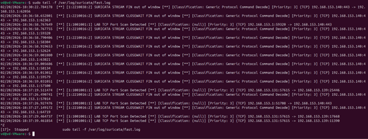
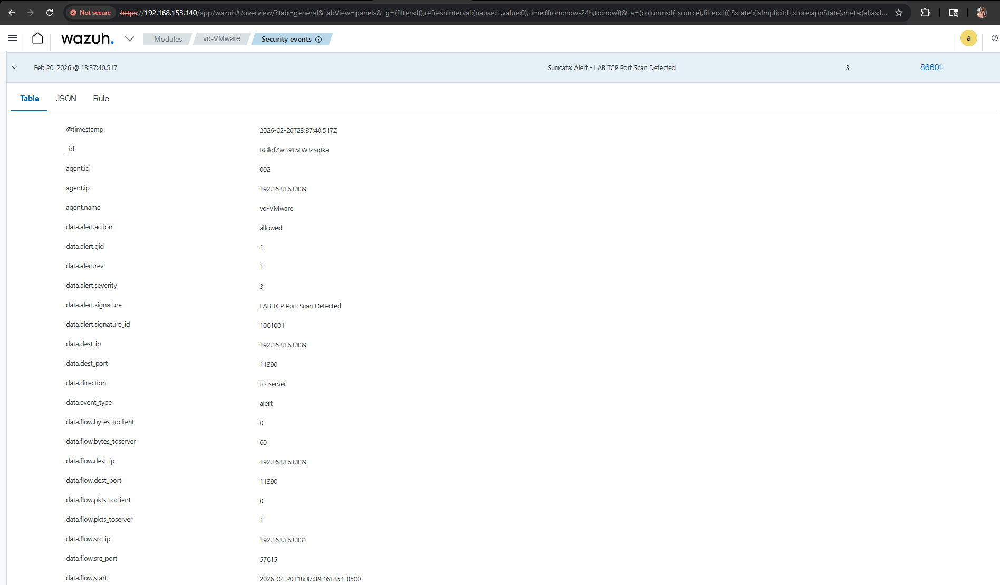
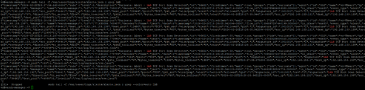
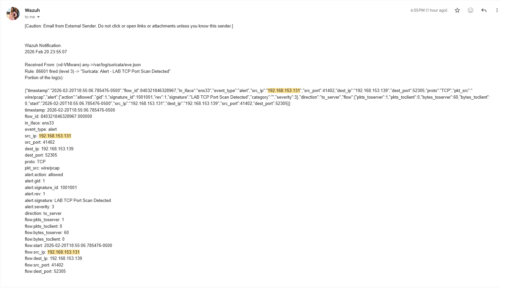
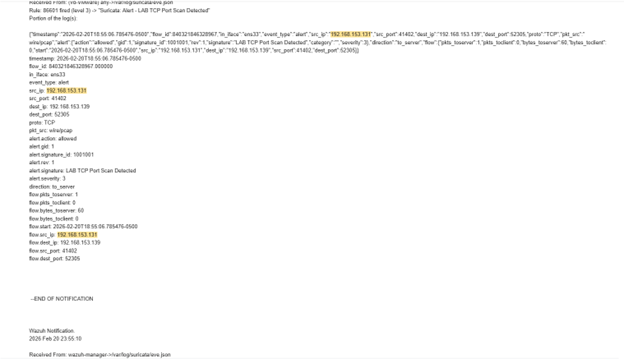

# Nmap Reconnaissance Detection Investigation

## 🧪 Scenario
Simulated reconnaissance activity from a Kali attacker machine targeting a Linux endpoint in the lab environment.

**Attacker IP:** 192.168.153.131  
**Target IP:** 192.168.153.139  
**Technique:** Nmap TCP SYN Scan  

---

## 🚨 Alert Triggered

Suricata generated multiple alerts indicating suspicious TCP scan behavior:

- LOCAL Possible TCP SYN Port Scan  
- LOCAL Possible TCP Connect Scan  
- LAB TCP Port Scan Detected (custom rule)

These alerts were ingested into Wazuh and correlated for validation.

---

## 📸 Detection Evidence

Below shows Suricata detecting the scan in real time from the attacker host:

---

## 🔍 Analysis

Observed behavior:
- High volume of TCP SYN packets from single source
- Multiple destination ports probed
- Pattern consistent with reconnaissance activity

Suricata rules triggered:
- Emerging Threats scan signatures
- Custom local rule for lab validation

Traffic verified using:
- tcpdump
- Suricata fast.log
- Wazuh alert pipeline

## 🛠 Detection Pipeline

Kali Attacker → Target Endpoint → Suricata IDS → Wazuh SIEM → Email Alert
Alert correlation confirmed:
- Source host
- Scan pattern
- Alert classification

Note: The timestamp in the email alert differs from the Wazuh event timestamp due to timezone conversion. The Wazuh manager records logs in UTC, while the email client displays time in the analyst’s local timezone. Both timestamps represent the same event.

---

## 🎯 Outcome

The lab successfully detected:
- TCP SYN scan activity
- Reconnaissance behavior
- IDS → SIEM alert pipeline functionality

This validates that the detection stack is functioning correctly in a simulated SOC environment.

---

## 🚀 Next Improvements

Planned enhancements:
- Add firewall telemetry correlation
- Integrate Nessus vulnerability scan detection
- Expand detection rules for lateral movement

