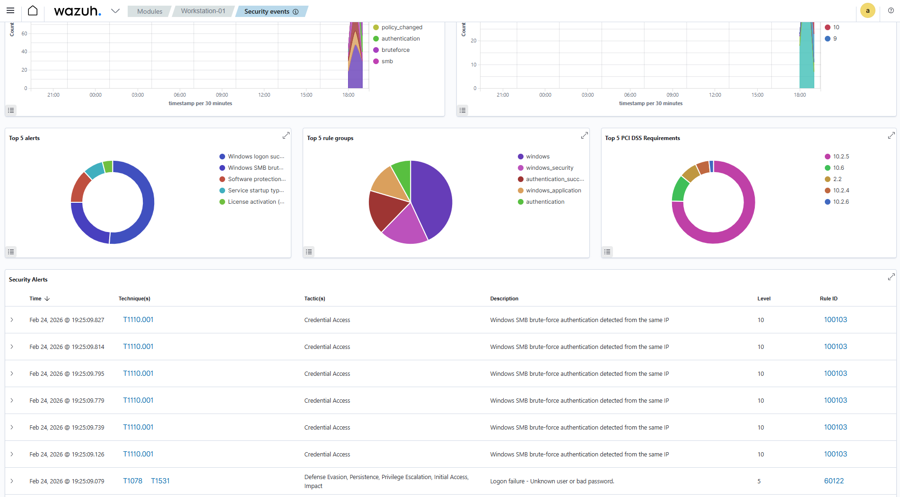
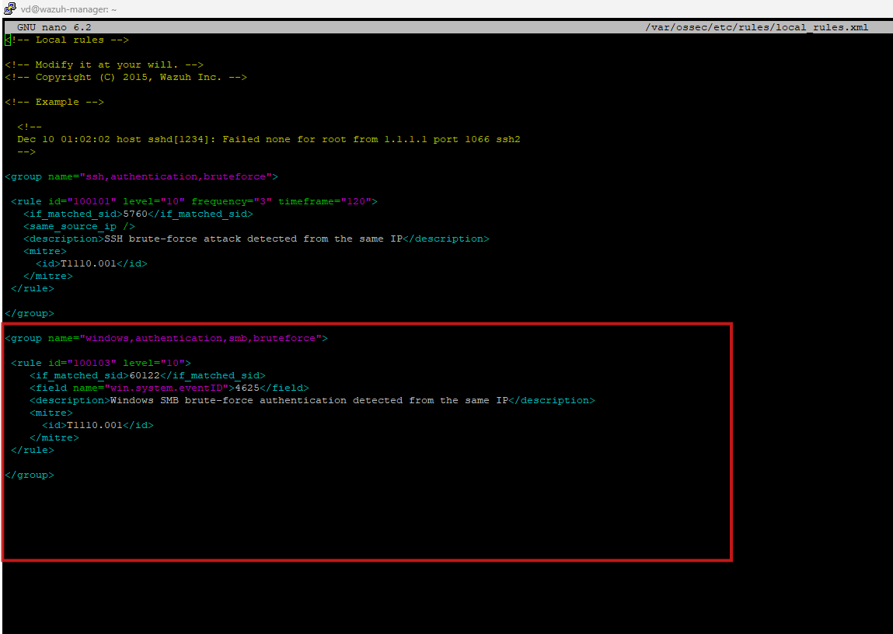
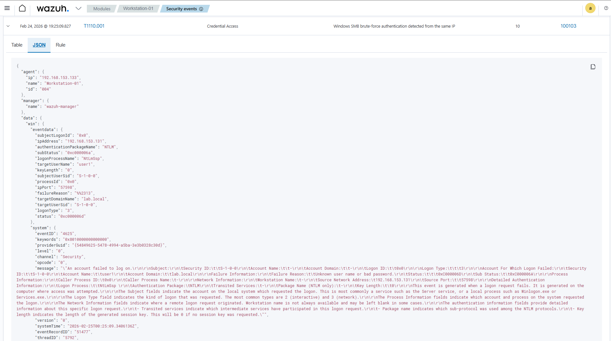
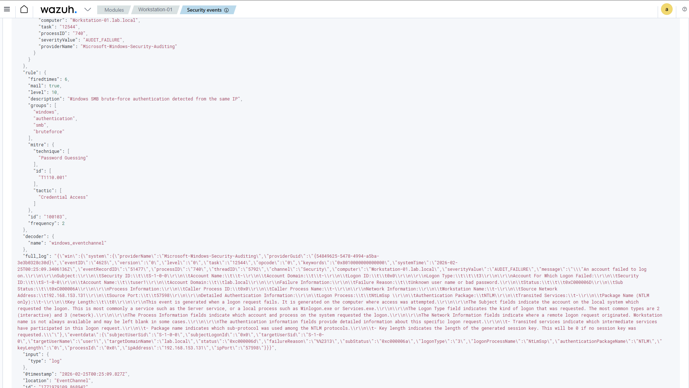
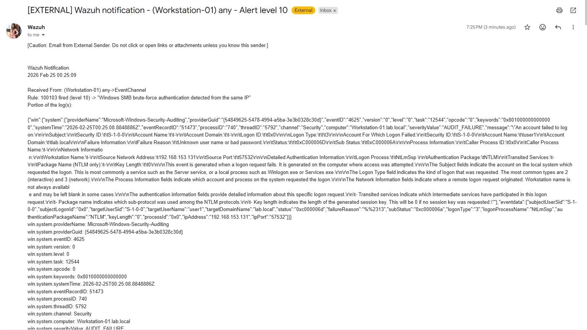

# SMB Brute Force Detection — Windows Endpoint

## Objective

Simulate and detect SMB brute-force authentication attempts against a Windows domain-joined endpoint using Wazuh SIEM.

This investigation demonstrates how repeated failed network logon attempts are logged, correlated, and escalated into a high-severity alert mapped to MITRE ATT&CK.

---

## Environment

* **Attacker:** Kali Linux
* **Target:** Windows 10 workstation (domain-joined)
* **Domain:** lab.local
* **SIEM:** Wazuh
* **Log source:** Windows Security Event Log
* **Protocol:** SMB (port 445)
* **Relevant Event ID:** 4625 (Failed Logon)

---

## Attack Simulation

Multiple authentication attempts were generated from the Kali attacker machine using invalid credentials against a domain account over SMB.

The attack targeted:

* Host: `192.168.153.133`
* Account: `lab.local\user1`
* Protocol: SMB (port 445)

Tools used for simulation:

* crackmapexec

The attacker repeatedly attempted login with incorrect passwords, generating multiple Windows Event ID 4625 entries.

---

## Log Source and Telemetry

Windows records failed network logons under:

* **Event ID:** 4625
* **Logon Type:** 3 (Network logon)
* **Authentication package:** NTLM
* **Source IP:** attacker machine
* **Target user:** domain account

These logs were forwarded to Wazuh via the Windows agent.

---

## Detection Logic

Wazuh monitors Windows Security logs and correlates repeated failed authentication attempts.

When multiple Event ID 4625 failures occur from the same source IP within a short timeframe, a custom correlation rule triggers a brute-force alert.

### Custom Wazuh Rule

* **Rule ID:** 100103
* **Level:** 10
* **Condition:** Multiple failed logons from same source IP
* **Event ID monitored:** 4625
* **Detection:** Windows SMB brute-force authentication detected from same IP

---

## MITRE ATT&CK Mapping

* **Tactic:** Credential Access
* **Technique:** Brute Force
* **Technique ID:** T1110
* **Sub-technique:** Password Guessing (T1110.001)

Repeated failed logons indicate an attempt to guess credentials through automated password attempts.

---

## Evidence

### 1. Wazuh Dashboard Alerts

Multiple alerts generated showing SMB brute-force activity detected from the same IP.

---

### 2. Wazuh Rule Trigger

Custom rule successfully correlated multiple failures into a high-severity alert.

---

### 3. Raw Windows Security Log

Event ID 4625 entries confirming failed authentication attempts.

Fields observed:

* Source IP address
* Target username
* Domain name
* Logon type 3
* NTLM authentication
* Failure reason: bad username or password

---

### 4. Email Alert Notification

Wazuh generated level-10 email alerts confirming detection.

---

## SOC Analysis

Indicators of brute-force activity:

* Multiple failed logons within short timeframe
* Same source IP
* Same target account
* Network logon attempts
* NTLM authentication failures

This pattern indicates automated credential-guessing activity.

If successful, such activity could lead to:

* Unauthorized access
* Lateral movement
* Privilege escalation

---

## Why SMB Brute-Force Instead of SSH on Windows

In enterprise environments:

* Windows systems primarily authenticate over SMB and domain services
* SSH is usually not enabled by default on Windows
* SMB brute-force provides a more realistic enterprise attack scenario

This simulation reflects common attacker behavior in Active Directory environments.

---

## Detection Outcome

✔ Windows Event ID 4625 captured

✔ Multiple failed logons detected

✔ Correlation rule triggered

✔ High-severity alert generated

✔ Email notification received

✔ MITRE mapping applied

✔ Detection validated in SIEM

---

## Lessons Learned

* Windows brute-force attacks commonly target SMB and domain accounts
* Event ID 4625 is critical for authentication monitoring
* Correlation rules are necessary to detect brute-force patterns
* Email alerting ensures SOC visibility
* Custom Wazuh rules improve detection accuracy

---

## Conclusion

This lab successfully simulated a realistic SMB brute-force attack against a Windows endpoint and demonstrated how Wazuh detects and correlates authentication failures into actionable alerts.

The investigation validates detection logic for credential-guessing attacks and maps activity to MITRE ATT&CK for SOC analysis.

