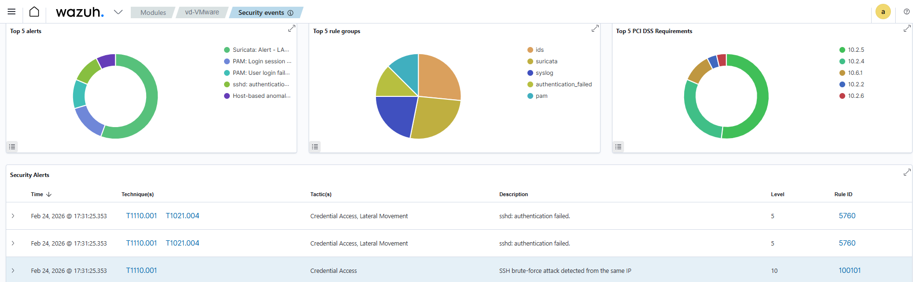
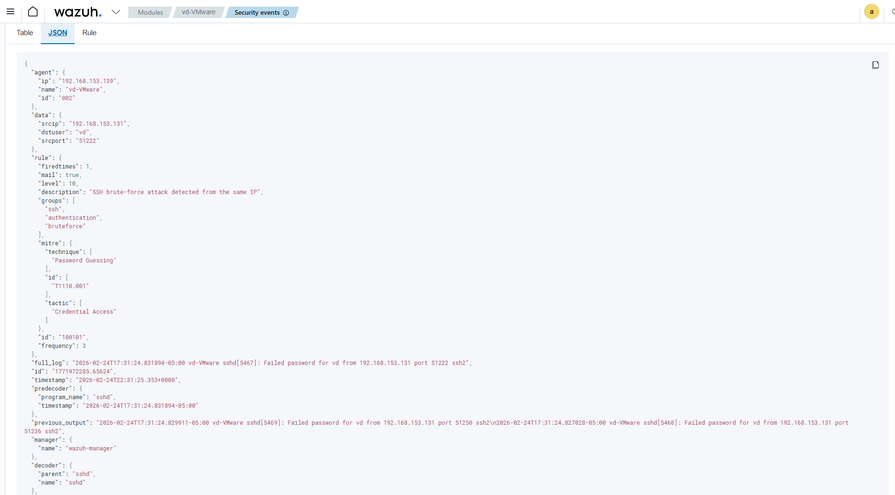
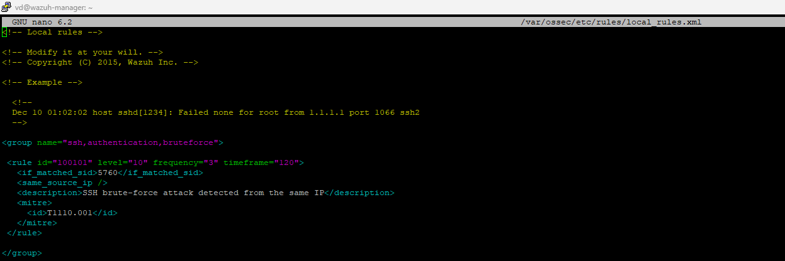
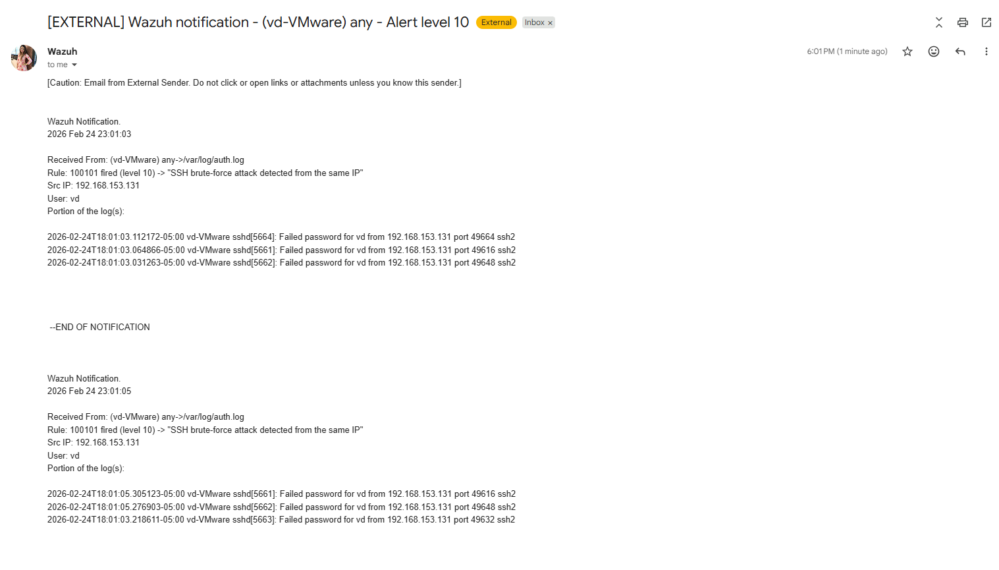

# SSH Brute Force Detection – Linux Endpoint

## Objective
Simulate and detect SSH brute-force activity against a Linux endpoint using Wazuh SIEM.

## Environment
- Attacker: Kali Linux
- Target: Linux endpoint (Ubuntu)
- SIEM: Wazuh
- Log source: /var/log/auth.log

## Attack Simulation
Brute-force attempts were generated from an attacker machine using invalid credentials against the SSH service.

Multiple failed login attempts from the same source IP triggered Wazuh correlation rules.

## Detection Logic
Wazuh rule **100101** detects repeated SSH authentication failures from the same source IP within a defined timeframe.

- Rule ID: 100101  
- Level: 10  
- MITRE: T1110.001 – Password Guessing  
- Log source: auth.log  

## Evidence

### Wazuh Alert

### Rule Details

### Email Notification

## Outcome
Wazuh successfully detected the brute-force activity, correlated repeated failures from the same source IP, and generated a high-severity alert with email notification.

## Key Learning
- Log correlation across repeated authentication failures  
- Rule-based detection tuning  
- Email alert pipeline validation  
- MITRE ATT&CK mapping  
